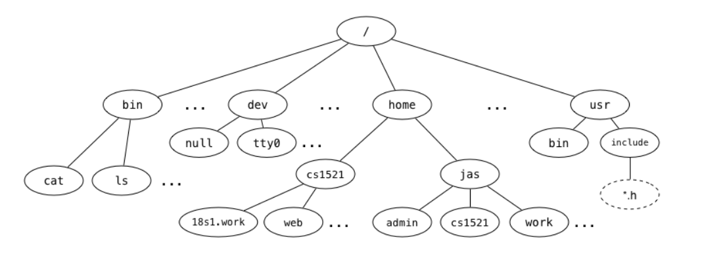

# Files!
Week 8 Tute

---

# Assignment 2

Due Week 10 Wednesday, 8pm

---

# Q1 - Unix Filesystem
We say that the Unix filesystem is **tree-structured**, with the directory called `/` as the root of the tree, e.g.



---

# Q1a - Unix Filesystem
What is the full pathname of COMP1521's `web` directory?


COMP1521's web directory is `/home/cs1521/web`

---

# Q1b - Unix Filesystem
Which directory is `~jas/../..`?


`~jas` is shorthand for `/home/jas`, so `~jas/../..` is the root directory (`/`)

---

# Q1c - Unix Filesystem
Links to the children of a given directory are stored as entries in the directory structure. Where is the link to the parent directory stored?


The link to the parent directory is also stored as an entry in the directory structure, called `..`

---

# Q1d - Unix Filesystem
What kind of filesystem object is `cat`?


`cat` is a regular file, which happens to contain executable machine code.

---

# Q1e - Unix Filesystem
What kind of filesystem object is `home`?


`home` is a directory.

---

# Q1f - Unix Filesystem
What kind of filesystem object is `tty0`?


`tty0` is a **character special file**, a file that represents a device which can read and write a byte-stream, which is typically interpreted as characters.

---

# Q1g - Unix Filesystem
What kind of filesystem object is a symbolic link? What value does it contain?


A symbolic link is a special kind of file that simply contains the name of another file.

---

# Q1g - Unix Filesystem
Symbolic links change the filesystem from a tree structure to a graph structure. How do they do this?


Symbolic links produce a graph because they allow arbitrary links between filesystem objects. Without symlinks, the only "connections" in the filesystem are parent/child links, which produce a tree.

---

# Opening a File

If you want to read from or write to a file, you need to open the file first. `fopen` is a convenient way to do this:

```C
FILE *fopen(const char *pathname, const char *mode);
```

You tell `fopen` the name of the file you wish to open, and whether you want to open the file for reading (mode `"r"`), for writing (mode `"w"`), or for appending (mode `"a"`).

If the open request was successful, `fopen` will return a pointer to the file stream that has been opened, otherwise it returns `NULL`.

---

# Cases where `fopen` will return `NULL`

- If the file you tried to open for reading does not exist.
- If you try to open a file you do not have permission to access.
- If the "mode" string was invalid.
- If the system is out of memory.
- If you try to create a file and your quota of disk blocks or inodes has been exhausted.
- If the pathname was too long.

...and many more reasons.

---

# Printing Errors

When `fopen` fails, it sets the global variable `errno` to a value representing the error.

There are a few ways to turn this `errno` to a string, or print it - the most common option is to call `perror`.

`perror` takes one string as an argument, and prints that string to `stderr`, then prints an error message described by the `errno` global variable

```C
#include<stdio.h> // For perror

FILE *fp = fopen("fakefile.txt", "r"); // Returns null, sets perror
if (fp == NULL) {
    // Prints "File error: No such file or directory"
    perror("File error");
}
```

---

# Reading and Writing Data
- `int fgetc(FILE *stream)`
- `fputc(int c, FILE *stream)`
- `char *fgets(char *s, int size, FILE *stream)`
- `fputs(char *s, FILE *stream)`

`fgetc` and `fputc` read/write a single character/byte.
`fgets` and `fputs` read/write until they reach `\n` or `EOF`.

You can also look up `fprintf` and `fscanf` - they work like `printf` and `scanf`, but you can read or write from a file instead of the terminal.

---

# Q2

Write a C program, which is given one command-line argument, the name of a file, and which prints the first line of that file to `stdout`. If given an incorrect number of arguments, or if there was an error opening the file, it should print a suitable error message.

> Tip: We don't need to store the whole line at once.

---

# Q3

Write a C program, which is given one command-line argument, the name of a file, and which reads a line from `stdin`, and writes it to the specified file; if the file exists, it should be overwritten.

> Tip: We don't need to store the whole line at once.

---

# Q4

Write a C program, which is given one command-line argument, the name of a file, and which reads a line from `stdin` and appends it to the specified file.

> Tip: The solution will be similar to Q3.

---

# Q5

Write a C program, q5.c, which is given 1 or more command-line arguments.

If there is only 1 command-line argument it should read lines from stdin and print them to stdout iff they contain the string specified as the first command line argument.

If there are 2 or more command line arguments, it should treat arguments after the first as filenames and print any lines they contain which contain the string specified as the first command line arguments.

When printing lines your program should prefix them with a line number.

It should print suitable error messages if given an incorrect number of arguments or if there is an error opening a file.

> Tip: Consider the function `strstr`

---

Q: Why should you not use `fgets` or `fputs` with binary data?

A: `fgets` or `fputs` work with C strings: arrays of bytes, terminated with a zero byte, `'\0'`.

Binary data may naturally contain zero bytes, and thus cannot be treated as a normal string, therefore functions that work on strings (including `fgets` or `fputs`) will not behave correctly.

---

Q: What does the following printf statement display?

```C
printf ("%c%c%c%c%c%c", 72, 101, 0x6c, 108, 111, 0x0a);
```

The ascii manual page will help with this; read it by running `man 7 ascii`.

---

Q: How many different values can `fgetc` return?

A: 257. It can return any number from 0-255, and it can also return `EOF`.

(Usually, `stdin` defines `EOF` as `-1`.)

---

Q: Why are the names of `fgetc`, `fputc`, `getc`, `putc`, `putchar`, and `getchar` misleading?

A: Programmers often think they are only for character I/O, but all of them just read or write a byte.

---

# `fseek`

When we open a file, we create a "file pointer" object. The file pointer points to a specific location in the file.

When we read or write from the file, the file pointer is moved forwards.

We can use the `fseek` function to manually move the file pointer.

(Make sure to `#include <stdio.h>`)

`fseek(file, offset, whence)`

Sets our position in the file to `offset + whence`

Whence can be:
- `SEEK_SET`
- `SEEK_END`
- `SEEK_CUR`

---

# Q6

Consider a file of size 10000 bytes, open for reading on with the file pointer `fp`, initially positioned at the start of the file (offset 0).

What will be the file position after each of these calls to `fseek()`?

(They are executed in sequence.)

- `fseek(fp, 0, SEEK_END);`
- `fseek(fp, -1000, SEEK_CUR);`
- `fseek(fp, 0, SEEK_SET);`
- `fseek(fp, -100, SEEK_SET);`
- `fseek(fp, 1000, SEEK_SET);`
- `fseek(fp, 1000, SEEK_CUR);`

---

# Q6 Answers

- `fseek(fp, 0, SEEK_END);` : 10,000
- `fseek(fp, -1000, SEEK_CUR);` : 9,000
- `fseek(fp, 0, SEEK_SET);` : 0
- `fseek(fp, -100, SEEK_SET);` : 0
- `fseek(fp, 1000, SEEK_SET);` : 1,000
- `fseek(fp, 1000, SEEK_CUR);` : 2,000